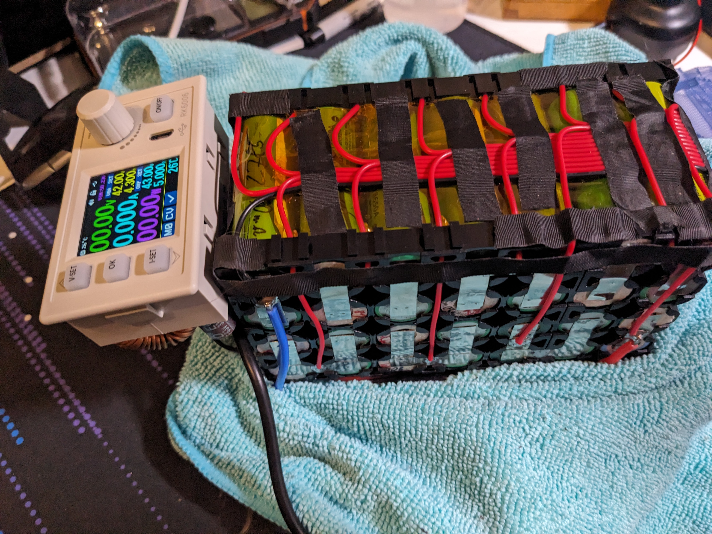

# Mobile-Battery-supplied-Lab-Power-Supply
- **Description:** This supply can power anything up to 55 Volts and 6 Amps, while being completely mobile. It combines a 14s2p spot welded battery made of recycled 18650 cells, with an adjustable DC-DC converter in a 3D printed enclosure.  In total the supply comes in under 2 kg and can deliver maximum power for about an hour (~300 Wh of energy).
- **Goals:** Backup-charge my e-scooter from 0-100 % SoC within 2 hrs
- **Technologies Used:**  Spot welding, 3D printing, DC-DC buck conversion, Soldering, CAD 

